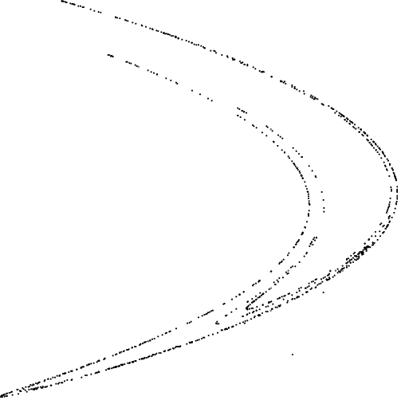
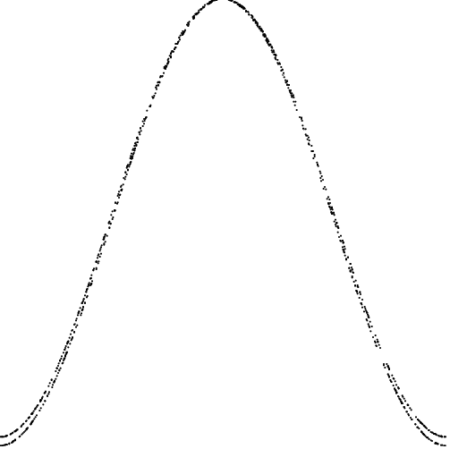

<!-- PROJECT LOGO -->
 

  

  <h3 align="center">go-chatotic-maps</h3>

  

    Online visualization engine for continuous and discrete chaotic maps
  

<!-- ABOUT THE PROJECT -->
## About The Project
Generates on-demand SVG renders of various attractor systems
Uses SVGo for rendering SVGs

### Continuous Maps
    
| Map        | Image           | Space-dim  |
| ------------- |:-------------:| -----:|
| Lorenz      |  | 3 |
| Duffing      |       |   2 |
| Thomas |       |    1 |

### Discrete Maps

| Map        | Image           | Space-dim  |
| ------------- |:-------------:| -----:|
| Henon      |  | 2 |
| Kaplan-Yorke      |       |   2 |
| De-Jong |       |    2 |
| Duffing |       |    2 |
